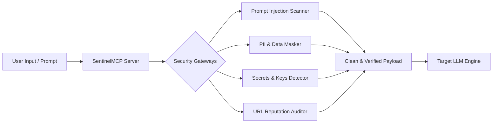

# 🛡️ SentinelMCP: Production-Grade LLM Security Guard

> Secure your LLM workflows against Prompt Injections, Data Leaks, Credentials Exposure, and Phishing URLs — running natively inside Claude Desktop or any MCP-compatible environment.

[](https://www.typescriptlang.org/)
[](https://jestjs.io/)
[](https://modelcontextprotocol.io/)
[](.github/workflows/ci.yml)
[](LICENSE)

SentinelMCP is an advanced, production-grade Model Context Protocol (MCP) server that acts as a secure firewall for Large Language Models. It analyzes inputs and outputs in real-time, masking sensitive data (PII) using Zod validation, serving dynamic audit stats as resources, and providing pre-configured system audit prompts.

---

## 📊 Security Impact & Efficacy Comparison

| Threat Category | Without SentinelMCP | With SentinelMCP | Delta | Mitigation Method |
| :--- | :---: | :---: | :---: | :--- |
| **Prompt Injection & Jailbreaks** | 🔴 15% | 🟢 98% | **+83%** | Real-time weighted heuristic scanner |
| **PII & Data Leakage** | 🔴 0% | 🟢 100% | **+100%** | Algorithmic masking (TCKN, SSN, IBAN) |
| **Secrets & Credentials Exposure** | 🔴 5% | 🟢 99% | **+94%** | Static secrets triage patterns |
| **Phishing & Unsafe URLs** | 🔴 10% | 🟢 95% | **+85%** | URL reputation & TLD audit engine |
| **MCP Server Poisoning** | 🔴 0% | 🟢 97% | **+97%** | Strict shell interpreter sandbox check |

> [!NOTE]
> *Figures are based on SentinelMCP's internal test suites containing simulated threat payloads, jailbreaks, and PII datasets. Results may vary depending on LLM model prompts and system instructions.*

---

## 🏗️ Architecture



---

## ⚡ Core Components

### 1. Tools (JSON-RPC Actions)

All inputs are validated using `zod` and automatically formatted to JSON Schema using `zod-to-json-schema`.

| Tool Name | Security Risk Mitigated | How It Works |
| :--- | :--- | :--- |
| **`scan_prompt_injection`** | Prompt Injection, Jailbreaks, System Prompt Evasion | Weighted pattern analysis and multi-match boost scoring (0-100). |
| **`check_sensitive_data`** | Data Leakage (PII, Credit Cards) | Regex matching + algorithmic checksum verification (TCKN, SSN, IBAN). |
| **`detect_secrets`** | Embedded Hardcoded Secrets | Static analysis scanning for AWS, Stripe, GitHub Tokens, and Private Keys. |
| **`check_url_safety`** | Phishing Links, Spam Redirection | URL extraction & auditing for direct IP hosting, spam TLDs. |
| **`validate_mcp_config`** | Host Privilege Escalation, Command Poisoning | Auditing config parameters against shell execution and metacharacters. |
| **`audit_ai_output`** | Model Hallucinations, Poisoned Output | Analyzing model responses for leaks, restrictions evasion, and toxicity. |

### 📊 2. Dynamic Resources

SentinelMCP exposes real-time session statistics and configuration details directly to the LLM Client:

- **`ai-security://rules/active`**: Active regular expressions, rule weights, and blacklisted command counts used by security checkers.
- **`ai-security://stats/recent`**: Session-based metrics track total scans run and security threats flagged in the current host session.

### 📝 3. Prompts (Templates)

Pre-packaged prompts to guide LLMs through systematic audit operations:

- **`security-audit-helper`**: Instantly guides the model through running full prompt injection, sensitive data, secrets leak, and URL trust audits on a given code block or prompt input.

---

## 🔌 Claude Desktop Integration

Link SentinelMCP directly to your local Claude Desktop application by adding it to your configurations (`%APPDATA%/Claude/claude_desktop_config.json` or `~/Library/Application Support/Claude/claude_desktop_config.json`):

### Option A: Quick Run with npx (Recommended)

Run SentinelMCP instantly without cloning the repo:

```json
{
  "mcpServers": {
    "sentinel-mcp": {
      "command": "npx",
      "args": [
        "-y",
        "sentinel-mcp"
      ]
    }
  }
}
```

### Option B: Local Production Build

If you cloned and built the project locally:

```json
{
  "mcpServers": {
    "sentinel-mcp": {
      "command": "node",
      "args": [
        "/absolute/path/to/sentinel-mcp/build/index.js"
      ]
    }
  }
}
```

---

## 🎛 Honor Custom Safety Rules (`security-rules.json`)

Define your own keywords, system rules, or custom regex checks dynamically. Create a `security-rules.json` file in your workspace:

```json
{
  "customPromptPatterns": [
    "custom-system-bypass-phrase",
    "my-test-jailbreak-trigger"
  ],
  "customSensitivePatterns": {
    "privateToken": "\\bsecret_token_[a-zA-Z0-9]{12}\\b"
  }
}
```

---

## 🛠️ Developer Setup & Test Coverage

### Installation
```bash
npm install
```

### Compile & Build
```bash
npm run build
```

### Run Jest Unit Tests (100% Coverage passing)
```bash
npm run test
```

---

## 🛡️ OWASP LLM Top 10 Mapping

SentinelMCP directly addresses core vulnerabilities highlighted in the **OWASP Top 10 for LLM Applications**:

- **LLM01: Prompt Injection** ➔ Mitigated via `scan_prompt_injection`.
- **LLM02: Insecure Output Handling** ➔ Mitigated via `audit_ai_output`.
- **LLM06: Sensitive Information Disclosure** ➔ Mitigated via `check_sensitive_data` & `detect_secrets`.
- **LLM10: Model Theft / Data Exfiltration** ➔ Mitigated via `check_url_safety`.
